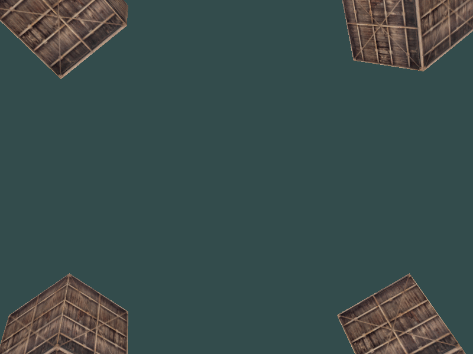
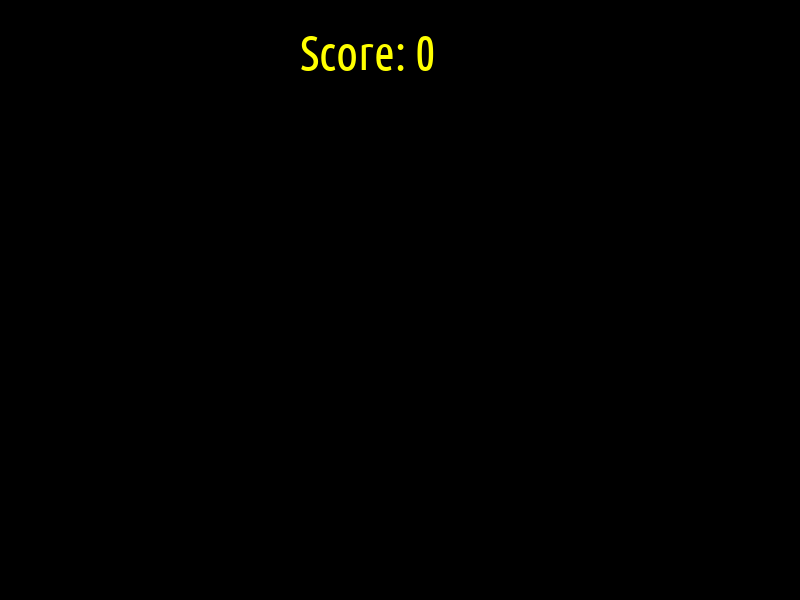

# Linear Algebra Project

## 3d rendering using OpenGL

## Installation

Under work

## Usage

```
make
```
inside each folder and run the executable

## Contents

### Rotating Rectangle


### FPV Camera



### Catch




